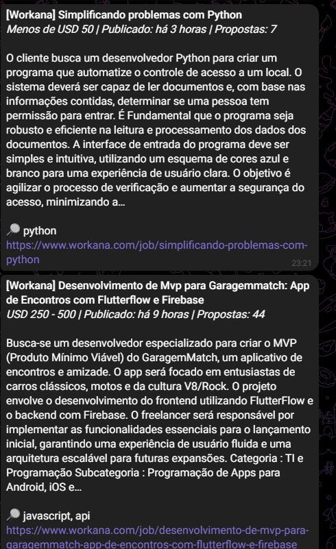
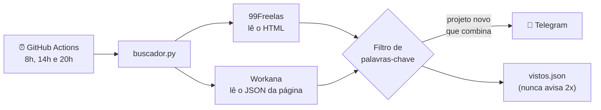

# 🛰️ Radar de Freelas

[](https://github.com/b4rao-dg/radar-freelas/actions/workflows/radar.yml)


Robô em Python que procura **projetos novos** no **99Freelas** e no **Workana**, filtra pelas palavras-chave que me interessam e me avisa no **Telegram**. Roda sozinho 3 vezes por dia no **GitHub Actions**, sem servidor e sem custo.

<p align="center">
  
</p>

## Por que eu fiz

Nas plataformas de freelas, quem manda proposta primeiro tem mais chance. Só que ficar atualizando duas páginas o dia inteiro atrás de projetos de Python e automação toma muito tempo. Então eu automatizei: o robô olha os sites por mim e só me chama quando aparece algo que combina comigo.

## Como funciona



1. O **GitHub Actions** liga o robô nos horários agendados (cron)
2. O robô baixa as páginas de projetos das duas plataformas com `requests` e extrai os dados com `BeautifulSoup`
3. Um filtro procura as palavras do `config.json` no título, na descrição e nas habilidades
4. Os projetos novos que combinam vão para o Telegram, com título, orçamento, descrição e link
5. Os IDs já vistos ficam salvos em `vistos.json`, e o próprio robô faz o commit desse arquivo

## Desafios que resolvi

- **Cada site entrega os dados de um jeito.** No 99Freelas os projetos estão no HTML. No Workana a lista visível é montada por JavaScript, então o robô lê o JSON que a página guarda no atributo `:results-initials` da tag `<search>`.
- **Datas que só aparecem no navegador.** O 99Freelas manda a data como um timestamp em milissegundos (`cp-datetime="1790172174000"`) e usa JavaScript para escrever o texto. Como o `requests` não roda JavaScript, o robô converte o número com `datetime`.
- **Fuso horário.** O GitHub Actions roda em UTC. O cron foi ajustado (`11,17,23` UTC = 8h, 14h e 20h em Brasília) e as datas são convertidas para -03:00.
- **Filtro sem falso positivo.** Uma busca simples por "sap" encontraria "whatsapp". O filtro usa expressão regular para achar só a palavra inteira, e ignora acentos e maiúsculas ("Automação" casa com "automacao").
- **Segredos fora do código.** O token do bot fica nos *secrets* do GitHub e chega ao script como variável de ambiente. Quando o Telegram recusa uma mensagem, o erro mostra só o motivo, nunca a URL que contém o token.

## Tecnologias

Python 3.12 · requests · BeautifulSoup4 · expressões regulares · API de bots do Telegram · GitHub Actions (cron)

## Estrutura

```
├── buscador.py              # o robô: busca, filtra e envia
├── configurar_telegram.py   # ajudante para descobrir o chat id e testar o bot
├── config.json              # palavras-chave e opções
├── vistos.json              # projetos já avisados (atualizado pelo robô)
└── .github/workflows/
    └── radar.yml            # agendamento no GitHub Actions
```

## Como usar

### 1. Rodar no seu computador (modo teste)

```bash
pip install -r requirements.txt
python buscador.py --teste
```

O modo teste só mostra os projetos no terminal. Não envia nada nem salva o `vistos.json`.

### 2. Criar o bot do Telegram (grátis)

1. No Telegram, abra uma conversa com **@BotFather** e mande `/newbot`
2. Escolha um nome. Ele te devolve um **token**, parecido com `123456:ABC-...`
3. Rode `python configurar_telegram.py`, cole o token e siga as instruções. O script confere o token, descobre o seu **chat id** e manda uma mensagem de teste

### 3. Colocar para rodar sozinho no GitHub

1. Faça um fork ou crie um repositório **público** (o Actions é gratuito em repositório público) com estes arquivos
2. Em **Settings → Secrets and variables → Actions → New repository secret**, crie:
   - `TELEGRAM_TOKEN`: o token do BotFather
   - `TELEGRAM_CHAT_ID`: o seu chat id
3. Na aba **Actions**, abra "Radar de Freelas" e clique em **Run workflow** para testar na hora

Depois disso ele roda sozinho às 8h, 14h e 20h (horário de Brasília).

> ⚠️ Nunca coloque o token direto no código. Como o repositório é público, qualquer pessoa veria.

## Personalizando

Tudo fica no `config.json`:

| Campo | Para que serve |
|---|---|
| `palavras_incluir` | Avisa se **qualquer** uma aparecer no título, na descrição ou nas habilidades |
| `palavras_excluir` | Descarta o projeto se **qualquer** uma aparecer |
| `paginas` | Quantas páginas ler em cada site por execução |
| `ativo` | `false` desliga uma das plataformas |
| `maximo_por_execucao` | Limite de mensagens por rodada, para não lotar o Telegram |

## Boas práticas

- Consulta poucas páginas, poucas vezes por dia, com pausa de 2 segundos entre elas
- Lê só páginas públicas, sem login, e respeita o `robots.txt` dos dois sites
- **Não envia propostas automaticamente.** O robô encontra os projetos, e quem lê e escreve a proposta sou eu

## Próximos passos

- [ ] Testes automatizados com `pytest` para os leitores de página
- [ ] Filtrar por orçamento mínimo
- [ ] Gerar um rascunho de proposta com IA (API gratuita do Gemini)

---

Feito por [Douglas](https://github.com/b4rao-dg) enquanto aprendo Python e começo como freelancer. Sugestões são bem-vindas!
